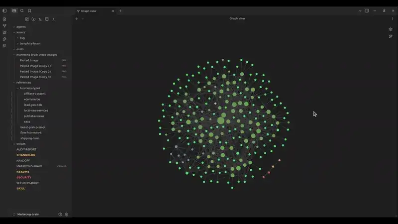
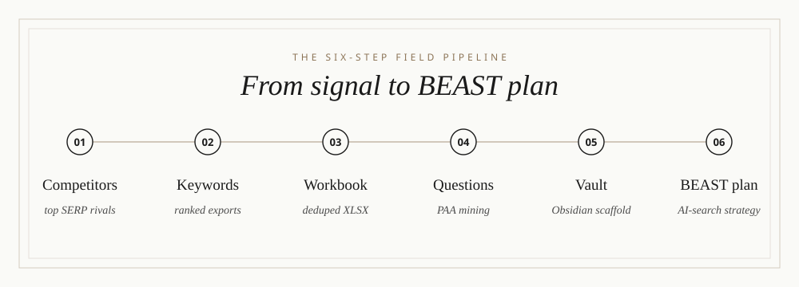
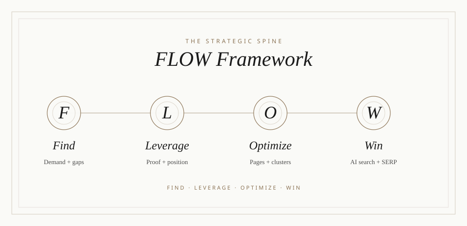
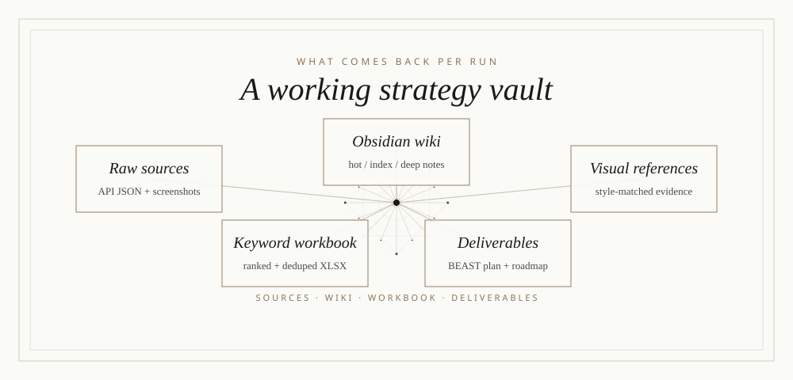
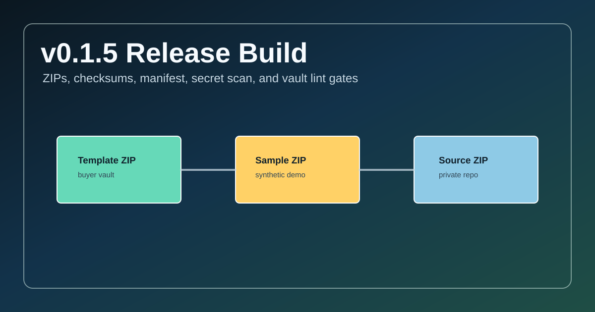
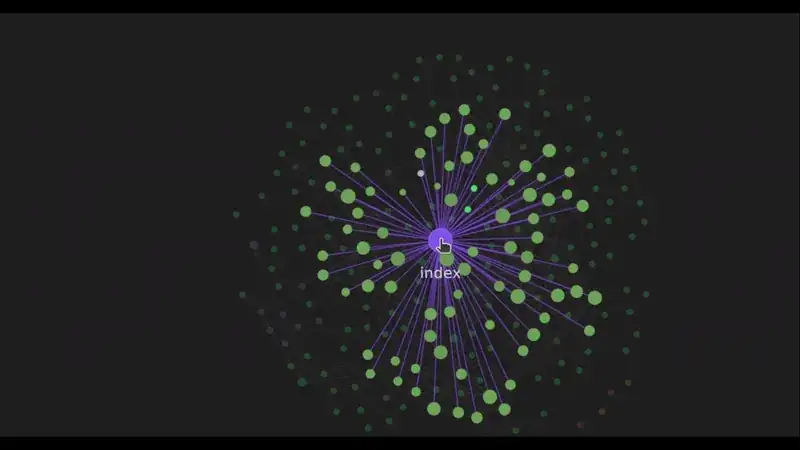

# marketing-brain

<p align="center">
  
</p>

<p align="center">
  
</p>

> Strategic SEO + marketing operating brain for agencies, operators, and AI
> Marketing Hub Pro members. It ships a polished Obsidian vault template, a
> Codex/Claude skill layer, deterministic demo data, DataForSEO research
> scripts, and source-cited BEAST plan reports. White-hat, read-only, and
> release-packaged for paid private distribution.

[](LICENSE)
[](CHANGELOG.md)
[](SECURITY.md)
[](https://github.com/AgriciDaniel/best-practices)

> Access is limited to paid Marketing Brain license holders and active AI
> Marketing Hub Pro members. This is source-available proprietary software,
> not an open-source project. See [LICENSE](LICENSE).

---

## What this is

Two artifacts shipped together:

1. **`assets/template-brain/`** - a buyer-facing Obsidian vault following the
   Hot/Index/Wiki pattern, with business-type variants, native Bases views,
   source manifests, visual reference capture, conservative AI search guidance,
   and a complete strategic concept layer: FLOW Framework, HCU Recovery,
   E-E-A-T, Information Gain, Topical Authority, Content Pruning, and
   execution governance.

2. **`marketing-brain` skill + CLI** - a neutral Codex/Claude/operator layer
   that scaffolds a client vault, runs DataForSEO competitor and keyword
   research when credentials are available, builds keyword workbooks, mines PAA
   surfaces, synthesizes a source-cited BEAST plan, renders Markdown/HTML/PDF
   reports, and tells the operator what to do next.

Marketing Brain is advisory and read-only. It does not mutate Google Search
Console, GA4, CMS, DNS, GBP, publishing systems, or third-party accounts.

---

## The 6-step pipeline

<p align="center">
  
</p>

1. **Find top competitors** with DataForSEO SERP and/or fixture-backed offline
   research.
2. **Pull ranked keywords** for competitors through DataForSEO Labs when live
   credentials are present.
3. **Build a deduplicated XLSX** sorted into practical opportunity sheets.
4. **Mine SERP/PAA context** for the highest-value terms and related questions.
5. **Populate the Obsidian vault** with source manifests, canonical notes,
   Bases-ready properties, and Hot/Index/Wiki navigation.
6. **Synthesize the BEAST plan** from FLOW + source data into a cited
   30/60/90-day execution plan and report package.

---

## Strategic framework

<p align="center">
  
</p>

FLOW is the synthesis spine: Find the demand and gaps, Leverage the proof,
Optimize the surface, then Win through source quality, execution velocity,
measurement discipline, and white-hat search fundamentals.

Marketing Brain improves eligibility, measurement, source quality, and
execution readiness across Google Search and AI search surfaces. It does not
promise rankings, traffic, recovery dates, or AI Overview inclusion.

---

## Install

### Private repo install

```bash
# Clone after your GitHub account has been granted access.
git clone git@github.com:AI-Marketing-Hub/marketing-brain.git
cd marketing-brain

# Install the skill for Codex, Claude, shared agents, or all targets.
./install.sh --target codex
./install.sh --target claude
./install.sh --target agents
./install.sh --target all

# Install the local CLI and optional PDF renderer support.
python -m pip install -e ".[pdf]"
marketing-brain --help
```

### Community ZIP install

Download the all-in-one private release asset:

```text
marketing-brain-v0.1.5.zip
```

It contains the source tree, template vault, sample vault, docs, skill entry,
scripts, license, notices, manifest, and checksums in one shareable package.

### Credentials

Live DataForSEO calls require environment variables:

```bash
export DATAFORSEO_LOGIN="your-login"
export DATAFORSEO_PASSWORD="your-password"
```

Credentials are read from environment variables only. They are never written to
vault notes, manifests, reports, fixtures, or release ZIPs.

---

## 5-minute operator kit

```bash
# 1. Run the offline demo.
marketing-brain demo

# 2. Inspect the generated sample vault.
marketing-brain lint --vault examples/sample-vault

# 3. Render a sample report.
marketing-brain report --vault examples/sample-vault --html-only

# 4. Open examples/sample-vault/ in Obsidian.
# Read CODEX.md, then wiki/hot.md, then wiki/index.md.
```

Full walkthrough: [docs/OPERATOR_KIT.md](docs/OPERATOR_KIT.md)
Product boundaries: [docs/PRODUCT_BOUNDARIES.md](docs/PRODUCT_BOUNDARIES.md)

---

## Client workflow

```bash
marketing-brain new acme-growth \
  --site https://www.example.com \
  --niche "B2B SaaS workflow automation" \
  --business-type saas \
  --owner "Strategy Owner"

marketing-brain competitors \
  --vault ~/marketing-brain-vaults/acme-growth \
  --site https://www.example.com \
  --seed-keywords "workflow automation software,b2b automation platform" \
  --dry-run

marketing-brain competitors --vault ~/marketing-brain-vaults/acme-growth --site https://www.example.com
marketing-brain keywords --vault ~/marketing-brain-vaults/acme-growth
marketing-brain xlsx --vault ~/marketing-brain-vaults/acme-growth
marketing-brain paa --vault ~/marketing-brain-vaults/acme-growth
marketing-brain synthesize --vault ~/marketing-brain-vaults/acme-growth
marketing-brain report --vault ~/marketing-brain-vaults/acme-growth
marketing-brain next --vault ~/marketing-brain-vaults/acme-growth
marketing-brain lint --vault ~/marketing-brain-vaults/acme-growth
```

Available business types include `affiliate-content`,
`local-seo-services`, `saas`, `ecommerce`, `lead-gen-b2b`, and
`publisher-news`.

---

## Visual reference capture

```bash
python scripts/capture_visual_references.py \
  --vault ~/marketing-brain-vaults/acme-growth \
  --url https://www.example.com \
  --project-dir /path/to/project \
  --name acme-homepage
```

This stores desktop/mobile screenshots, web page images, local project images,
a manifest, and a source note under `.raw/sources/visuals/`. Use it before
generated-image work so future visuals match the real site style without
copying unverified assets.

---

## What you get back per run

<p align="center">
  
</p>

For a client `acme-growth`:

```text
acme-growth/
├── CODEX.md                              Operating rules
├── shipping-rules.md                     Release standard
├── README.md                             Generated client-facing summary
├── acme-growth-Beast-Plan.pdf           Optional PDF deliverable
├── _attachments/                         Image folder
├── _templates/                           Note templates
├── .raw/
│   ├── .manifest.json                    Source registry
│   └── sources/
│       ├── dataforseo/                   Raw API JSON + digest
│       └── visuals/                      Optional screenshots + image refs
├── .obsidian/                            Pre-configured safe Obsidian settings
└── wiki/
    ├── hot.md                            Hot working memory
    ├── index.md                          Navigation map
    ├── overview.md                       Plain-language summary
    ├── log.md                            Append-only activity log
    ├── meta/                             Start Here, dashboards, Bases
    ├── audits/                           Findings, risks, inventories
    ├── concepts/                         FLOW, HCU, E-E-A-T, information gain
    ├── entities/                         Client, competitors, platforms
    ├── flows/                            Sprint blueprints
    ├── decisions/                        Decision records and rollback notes
    ├── pages/                            Page brief templates
    ├── keywords/                         Keyword strategy and cannibalization
    ├── sources/                          Source documentation
    └── deliverables/
        ├── ULTIMATE BEAST Plan.md
        ├── Implementation Roadmap.md
        ├── Full FLOW Review.md
        └── Dual Surface Scorecard.md
```

Plus a companion `keywords-<date>.xlsx` workbook with deduplicated keyword
data when keyword research is available.

---

## Release artifacts

`python scripts/package_release.py --version 0.1.5` builds:

- `marketing-brain-v0.1.5.zip` - all-in-one community ZIP.
- `marketing-brain-template-v0.1.5.zip` - Obsidian template vault only.
- `marketing-brain-sample-vault-v0.1.5.zip` - deterministic demo vault.
- `marketing-brain-source-v0.1.5.zip` - source package.
- `RELEASE_MANIFEST.json` - artifact metadata.
- `SHA256SUMS` - checksum ledger.

The release scanner blocks `.git`, caches, `.env`, private keys, local home
paths, real client domains, and common API key patterns from source and ZIP
contents.

---

## Cost control

DataForSEO charges per API call. The pipeline:

- Supports `--dry-run` previews before live calls.
- Requires both `DATAFORSEO_LOGIN` and `DATAFORSEO_PASSWORD` before paid paths.
- Keeps credentials out of generated notes, manifests, reports, and ZIPs.
- Writes raw paid-data responses with restricted file permissions.
- Leaves the vault valid and resumable if a paid-data step fails.

Typical live cost depends on seed count, competitor count, keyword depth, and
PAA limits. Start with dry runs and low caps before scaling.

---

## Current search positioning

The current source memo is
[references/current-search-requirements-2026-05-11.md](references/current-search-requirements-2026-05-11.md).
It uses official docs for Google AI features, generative AI content guidance,
spam policies, Search Console measurement behavior, DataForSEO endpoint
behavior, and Obsidian Bases/properties.

Use precise product language:

- Helps improve eligibility, source quality, measurement, and execution
  readiness.
- Does not guarantee rank #1, traffic, recovery, AI Overview inclusion, or
  AI-search citation.
- Keeps recommendations source-cited and rollback-aware.
- Keeps V1 read-only and advisory.

---

## How v0.1.5 was built

<p align="center">
  
</p>

Every release slice follows the best-practices loop: read first, write second,
verify third. v0.1.5 adds paid private release packaging, Codex + Claude
install targets, deterministic demo fixtures, schema discipline, conservative
current-search positioning, source-cited synthesis, report rendering, and
secret/local-path ZIP gates.

Live DataForSEO verification is intentionally gated by credentials. If
credentials are missing, the checklist marks the live path as blocked instead
of pretending it passed.

---

## Integration with other skills

- **SEO skills** - recommended companions for deeper page, technical, local,
  content, schema, GEO, and performance audits.
- **FLOW Framework** - `references/flow-framework.md` ships the canonical
  strategic backbone.
- **codex-obsidian / claude-obsidian** - the vault scaffold respects Obsidian
  conventions, Hot/Index/Wiki context loading, Bases, source notes, and graph
  health.
- **Blog/content skills** - BEAST plan recommendations can be handed into
  content execution workflows after approval.

---

<p align="center">
  
</p>

## Karpathy Hot/Index/Wiki pattern

Every vault scaffolded by this skill follows the three-layer context pattern:

- **`wiki/hot.md`** - small working-memory file. What changed, what is
  blocking, and what to do next.
- **`wiki/index.md`** - full navigation map. Section-grouped wikilinks to the
  vault.
- **`wiki/`** - deep notes loaded on demand through wikilinks and hubs.

For cross-agent sessions, point any agent at the vault with: "Read
`CODEX.md`, then `wiki/hot.md`, then `wiki/index.md`, then the relevant note."

---

## License & policy

- [LICENSE](LICENSE) - proprietary buyer/member license
- [SECURITY.md](SECURITY.md) - vulnerability disclosure policy + scope
- [SUPPORT.md](SUPPORT.md) - support path for license holders and members
- [CONTRIBUTING.md](CONTRIBUTING.md) - contribution policy for a proprietary repo
- [THIRD_PARTY_NOTICES.md](THIRD_PARTY_NOTICES.md) - attribution and notices
- [CHANGELOG.md](CHANGELOG.md) - release-by-release deltas
